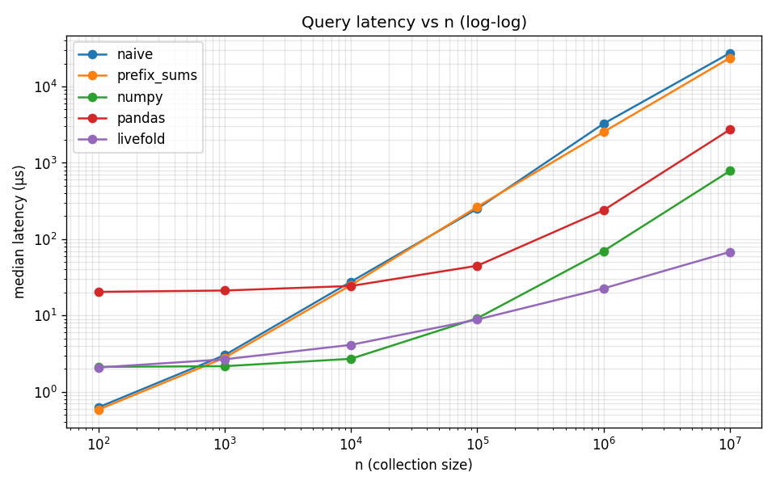
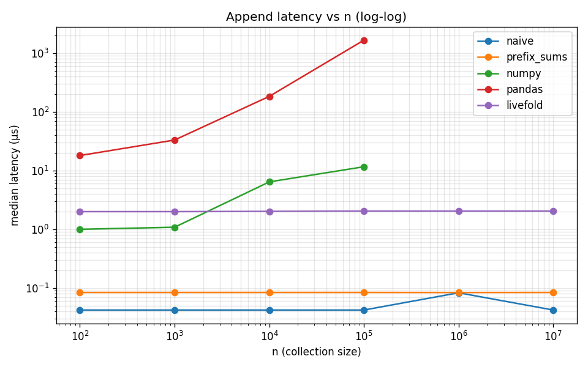

# Benchmarks

Median per-op latency at each collection size n. Lower is better.
Each datapoint is the median of 1000 queries / 1000 appends.
Generated by `uv run python -m benchmarks.run`.

## Backends

- `naive` — Python list, full slice + reduction per query
- `prefix_sums` — prefix array for sum; naive scan for max/min
- `numpy` — `np.ndarray`, rebuilt on append via `np.append` (capped at n=100,000 for the append benchmark — O(n) per append)
- `pandas` — `pd.Series`, rebuilt on append (capped at n=100,000 for the append benchmark — O(n) per append)
- `livefold` — `LiveFold` with `{sum, max, min}` folds

## Reading these curves

**Queries:** `livefold` wins above n ≈ 10⁴ and pulls ahead by 2+ orders of magnitude at n = 10⁶. `numpy` is competitive on query thanks to vectorized C-level reductions but loses to `livefold` at large n because every query still does a full scan over the slice. Below n ≈ 10³, `naive` and `prefix_sums` win on raw constant overhead, but the absolute gap is sub-microsecond. `prefix_sums` barely helps once you need max/min — they still scan the full range.

**Appends:** `naive` and `prefix_sums` append in single-digit nanoseconds (essentially free, at the timer's resolution floor). `livefold`'s amortized cost is roughly flat at ~2 µs. Both `numpy` and `pandas` rise linearly because every append rebuilds the underlying buffer — unusable for streaming workloads above n ≈ 10⁴.

**The takeaway:** `livefold` is the only backend that's competitive on both axes across all scales. `naive`/`prefix_sums` lose on query latency above n ≈ 10⁴; `numpy` and `pandas` lose on append latency above n ≈ 10⁴. If your workload mutates the sequence and queries arbitrary ranges, `livefold` is the curve that doesn't bend the wrong way.

## Query latency vs n

| n | naive | prefix_sums | numpy | pandas | livefold |
|---|---|---|---|---|---|
| 100 | 0.63 µs | 0.58 µs | 2.13 µs | 20.42 µs | 2.08 µs |
| 1,000 | 3.02 µs | 2.79 µs | 2.17 µs | 21.25 µs | 2.67 µs |
| 10,000 | 27.69 µs | 24.98 µs | 2.71 µs | 24.37 µs | 4.12 µs |
| 100,000 | 250.35 µs | 264.94 µs | 9.19 µs | 44.85 µs | 8.85 µs |
| 1,000,000 | 3259.19 µs | 2540.04 µs | 69.81 µs | 239.54 µs | 22.65 µs |
| 10,000,000 | 27443.98 µs | 23701.75 µs | 783.88 µs | 2725.60 µs | 68.12 µs |

## Append latency vs n

| n | naive | prefix_sums | numpy | pandas | livefold |
|---|---|---|---|---|---|
| 100 | 0.04 µs | 0.08 µs | 1.00 µs | 18.02 µs | 2.00 µs |
| 1,000 | 0.04 µs | 0.08 µs | 1.08 µs | 33.15 µs | 2.00 µs |
| 10,000 | 0.04 µs | 0.08 µs | 6.42 µs | 183.60 µs | 2.02 µs |
| 100,000 | 0.04 µs | 0.08 µs | 11.63 µs | 1664.50 µs | 2.04 µs |
| 1,000,000 | 0.08 µs | 0.08 µs | — | — | 2.04 µs |
| 10,000,000 | 0.04 µs | 0.08 µs | — | — | 2.04 µs |
